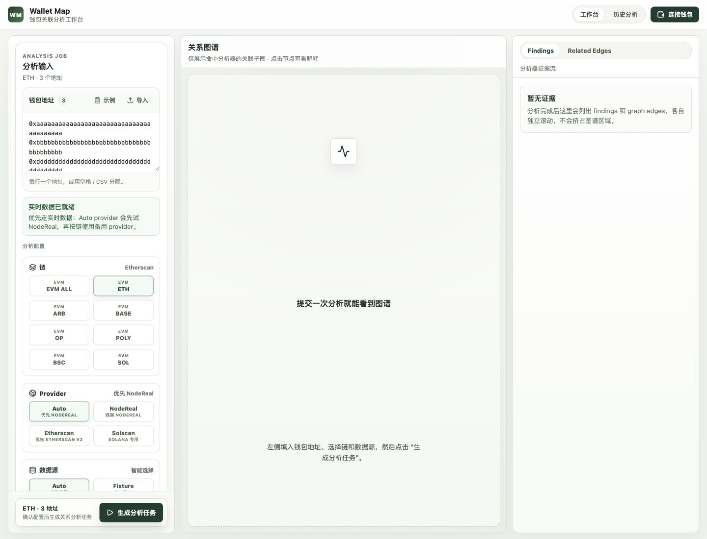

# Wallet Map

Wallet Map 是一个本地优先的钱包关系分析工作台，用于审阅一组钱包地址之间公开可见的链上证据。

它帮助用户检查直接转账、共同交易对手、多跳路径、共同合约交互、时间相近行为等关系信号。项目适用于个人链上足迹审计、公开数据研究和合规友好的复盘工作流。

Wallet Map 不处理私钥、助记词、签名、资产托管、交易发送或自动化钱包操作。

English documentation starts at [README.md](README.md). 项目文档同时维护英文和中文版本，见[项目文档](#项目文档)。

## 预览



线上应用：[https://wm.ruochen.app](https://wm.ruochen.app)

## 功能

- 面向 EVM 钱包地址组的关系分析。
- 工作台支持地址输入、进度追踪、图谱探索、证据复核和报告导出。
- 合成 fixture 模式可用于本地演示、测试和贡献者快速上手，不需要私有 API key。
- 支持通过 Etherscan-like provider 获取 live EVM 数据，并保留 NodeReal、Solscan 接入点。
- 支持关系图构建、默认分析器插件、多维 exposure scoring 和带证据的 findings。
- 支持导出 PDF、Markdown、JSON、CSV。
- 可选 PostgreSQL 持久化，用于历史记录和回放。
- 可选 Redis job state，用于 serverless 部署。
- 私有标签管理页面默认关闭。

## 工作区结构

```text
apps/
  web/                 Next.js 应用和 API routes
packages/
  core/                领域模型、图契约、评分基础
  adapters/            链和数据源适配器
  analyzers/           钱包关系分析器插件
  exporters/           报告导出器
  labels/              标签 provider 和 enrichment
  storage/             持久化接口与 SQL migrations
docs/                  双语项目文档
fixtures/              测试和演示用合成样本数据
```

## 快速开始

```bash
pnpm install
pnpm dev
```

打开本地应用后，可以使用首页样例地址以 fixture 模式运行分析。Fixture 模式使用 `fixtures/sample-events.json`，不需要 API key、PostgreSQL 或 Redis。

常用检查：

```bash
pnpm typecheck
pnpm test
pnpm --filter @wallet-map/web build
```

## 配置

本地开发前复制示例环境变量文件：

```bash
cp .env.example .env.local
cp apps/web/.env.example apps/web/.env.local
```

不要提交真实 `.env` 文件、API key、带凭据的 RPC URL、私有钱包数据或用户提供的真实钱包地址。

### 数据源

- `Auto`：已配置 live provider 时使用 live 数据，否则回退到 fixture。
- `Fixture`：始终使用合成样本数据。
- `Live`：要求对应 provider 凭据，缺失时返回明确错误。

Provider 环境变量包括 `ETHERSCAN_API_KEY`、`NODEREAL_API_KEY`、`NODEREAL_BSC_API_KEY`、`SOLSCAN_API_KEY`、`CHAINBASE_API_KEY`。

### 存储

PostgreSQL 和 Redis 对本地开发都是可选能力。

Vercel Preview 和 Production 部署建议启用 Redis，以便分析 job 状态能跨 serverless 函数实例保存。Job store 支持 Upstash REST 变量和 Redis 协议 URL：

```bash
STORAGE_REDIS_ENABLED=true
UPSTASH_REDIS_REST_URL=https://...
UPSTASH_REDIS_REST_TOKEN=...
# 或 REDIS_URL=rediss://...
```

只有需要持久化历史、回放和数据库标签管理时才启用 PostgreSQL：

```bash
STORAGE_POSTGRES_ENABLED=true
DATABASE_URL=postgresql://...
pnpm db:migrate
```

标签管理页面默认关闭：

```bash
NEXT_PUBLIC_LABEL_MANAGER_ENABLED=false
```

## 部署

当前生产环境部署在 Vercel：

- 应用：[https://wm.ruochen.app](https://wm.ruochen.app)
- Build command：`pnpm --filter @wallet-map/web build`
- Install command：`pnpm install --frozen-lockfile`
- Output directory：`apps/web/.next`

环境变量和托管 Redis 配置见 [Vercel 部署](docs/vercel-deployment.zh.md)。

## 项目文档

- 总览：[English](docs/README.md), [中文](docs/README.zh.md)
- 架构图：[English](docs/architecture-map.en.md), [中文](docs/architecture-map.md)
- 开发流程：[English](docs/development-workflow.md), [中文](docs/development-workflow.zh.md)
- 代码风格：[English](docs/code-style.md), [中文](docs/code-style.zh.md)
- 提交规范：[English](docs/commit-convention.md), [中文](docs/commit-convention.zh.md)
- 文档风格：[English](docs/documentation-style.md), [中文](docs/documentation-style.zh.md)
- 数据库结构：[English](docs/database-schema.md), [中文](docs/database-schema.zh.md)
- Vercel 部署：[English](docs/vercel-deployment.md), [中文](docs/vercel-deployment.zh.md)
- 分析规范：[English](docs/analysis-guidelines.md), [中文](docs/analysis-guidelines.zh.md)
- 开源规范：[English](docs/open-source.md), [中文](docs/open-source.zh.md)
- 发布流程：[English](docs/release-process.md), [中文](docs/release-process.zh.md)
- 贡献指南：[English](CONTRIBUTING.md), [中文](CONTRIBUTING.zh.md)
- 安全策略：[English](SECURITY.md), [中文](SECURITY.zh.md)
- 行为准则：[English](CODE_OF_CONDUCT.md), [中文](CODE_OF_CONDUCT.zh.md)
- 更新日志：[English](CHANGELOG.md), [中文](CHANGELOG.zh.md)
