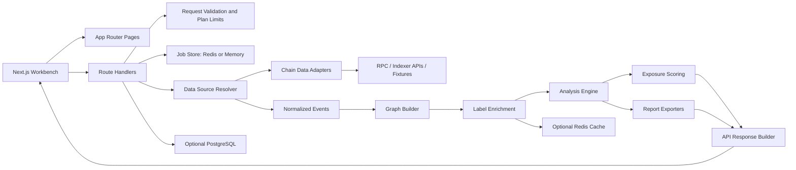

# Wallet Map Architecture Map

中文版本：[architecture-map.md](architecture-map.md)

## 1. Project Positioning

Wallet Map is a local-first wallet relationship analysis workbench for individuals, researchers, and small teams. It helps users review public on-chain relationship signals between a group of addresses. The project focuses on evidence collection, graph exploration, and human review priority. It does not handle private keys, seed phrases, signatures, custody, or automated wallet operations.

Core goals:

- Normalize multi-chain transactions, transfers, contract interactions, and labels into an explainable relationship graph.
- Surface evidence for direct transfers, shared funding, shared destinations, same-contract interactions, time-adjacent behavior, and multi-hop paths.
- Use scoring and evidence details to support human review, not to claim identity or ownership.
- Remain open-source friendly, pluggable, and runnable in local environments without managed databases.

## 2. Runtime Boundary

The current project includes:

- Next.js web workbench.
- EVM address analysis, with Ethereum, Arbitrum, Base, and BSC as priority chains.
- Fixture datasets for keyless demos, tests, and contributor onboarding.
- Adapter points for Etherscan-like APIs, NodeReal, Solscan, and future providers.
- Graph construction, default analyzers, relationship scoring, evidence tables, and report export.
- Optional PostgreSQL persistence, Redis job state, and label cache.

The project does not include:

- Wallet signing, transaction sending, private keys, or seed phrase handling.
- Large-scale address crawling or batch monitoring systems.
- Guidance for bypassing third-party policies or review systems.
- Claims that weak on-chain signals prove identity.

## 3. High-Level Architecture

## 4. Application Entry Points

The web application lives in `apps/web` and uses the Next.js App Router.

Main pages:

- `/`: analysis workbench for address input, chain/source selection, progress, graph, evidence, scoring, and exports.
- `/history`: analysis history. It returns persisted records only when PostgreSQL is configured.
- `/labels`: maintainer-only label manager, disabled by default through `NEXT_PUBLIC_LABEL_MANAGER_ENABLED`.

Main APIs:

- `POST /api/analyze`: creates an analysis job, validates input, runs the pipeline, and returns the result.
- `GET /api/analyze/jobs/:id`: reads job status, progress, and completed output.
- `GET /api/analyze/jobs`: lists historical jobs when PostgreSQL is enabled.
- `GET /api/labels` and `POST /api/labels`: read and maintain local labels when the label manager and database are enabled.
- Wallet login, ENS, and session APIs support product limits and history ownership; they are not part of relationship inference.

## 5. Data Flow

A standard analysis request follows this path:

1. The user submits addresses, chains, time range, and source settings from the workbench.
2. `POST /api/analyze` validates addresses, request size, and anonymous or signed-in plan limits.
3. The API creates a job. Redis stores it when available; otherwise the app uses an in-memory job store.
4. The data source resolver selects fixture, Etherscan-like, NodeReal, Solscan, or future adapters.
5. Adapters fetch or read raw events and return normalized events.
6. The graph builder converts events into nodes, edges, and evidence references.
7. Label enrichment merges built-in labels, optional Chainbase/Etherscan labels, PostgreSQL labels, and Redis cache entries.
8. The analysis engine runs default analyzers and produces findings.
9. The scoring module produces explainable scores and confidence.
10. The response builder returns graph data, evidence, scoring, exports, and job state.
11. PostgreSQL stores completed snapshots when persistence is enabled.

## 6. Module Boundaries

### `apps/web`

Contains the product UI, routes, API orchestration, sessions, and deployment-time configuration. Page components should not own data-source logic, label-provider logic, storage implementation, or complex graph algorithms.

### `packages/core`

Defines shared domain models, normalized events, graph structures, analysis context, and scoring primitives. This is the stable contract layer across apps and adapters.

### `packages/adapters`

Wraps chain data sources. Adapters fetch and normalize data; they do not make relationship judgments.

### `packages/analyzers`

Implements relationship rules such as direct transfer, multi-hop paths, shared funding, shared destination, same-contract interaction, temporal proximity, and bridge correlation.

### `packages/labels`

Provides built-in entity labels and external label-source integration. Labels are data enrichment and should not be hard-coded inside pages or scattered API conditionals.

### `packages/storage`

Owns PostgreSQL schema, repository contracts, and persistence implementations. The web app enables this layer through runtime configuration.

### `packages/exporters`

Generates Markdown, JSON, CSV, PDF, and future report formats. Exporters should preserve evidence references and support future redaction behavior.

## 7. Storage and Cache

Wallet Map can run in local fixture mode without PostgreSQL or Redis. On serverless platforms such as Vercel, Redis is recommended for deployed environments so job state and progress survive across function instances.

### Redis

Redis is used for:

- analysis job status and progress
- in-flight analysis result cache
- hot label-list and label-lookup cache

The current implementation reads `STORAGE_REDIS_ENABLED=true` and prefers `UPSTASH_REDIS_REST_URL` / `UPSTASH_REDIS_REST_TOKEN`. It also supports `KV_REST_API_URL` / `KV_REST_API_TOKEN` and `REDIS_URL`. When Redis is not configured, the app falls back to an in-memory job store. Memory mode is suitable for local single-process demos, not for durable job state on Vercel.

### PostgreSQL

PostgreSQL is used for:

- completed analysis job snapshots
- normalized events, graph nodes, graph edges, and findings
- `known_labels`
- history list and replay

The current implementation reads `STORAGE_POSTGRES_ENABLED=true` and `DATABASE_URL`. When PostgreSQL is not configured, history and label management return storage-disabled states.

## 8. Extension Points

The project reserves four extension types:

- Chain Adapter: add a chain or data provider.
- Analyzer: add a relationship analysis rule.
- Label Provider: add an entity-label source.
- Exporter: add a report format.

Extensions should follow the existing package boundaries and preserve typed input, output, and error contracts.

## 9. Privacy and Safety Principles

- Local and fixture-mode operation are supported by default.
- Do not commit real API keys, bearer tokens, JWTs, real wallet addresses, or user-private data.
- Public examples use synthetic addresses such as `0xaaaaaaaaaaaaaaaaaaaaaaaaaaaaaaaaaaaaaaaa`.
- Reports and UI copy describe “relationship signals” and “review priority,” not proof of identity.
- The label manager is disabled by default and should be enabled only when maintainers explicitly need it.
