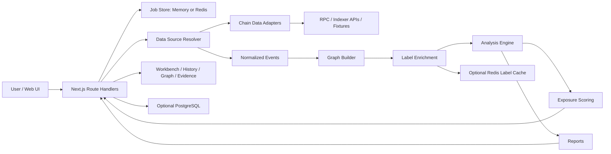

# Wallet Map Architecture Map

中文版本：[architecture-map.md](architecture-map.md)

## 1. Project Positioning

Wallet Map is a local-first wallet relationship audit workbench for individuals, small teams, and researchers. It helps users review visible on-chain signals between a group of addresses:

- direct or indirect fund flows
- shared counterparties
- shared contract interactions
- bridge and cross-chain route evidence
- time-adjacent behavior patterns
- graph paths that require human review

The project must remain open-source friendly, privacy-conscious, pluggable, and multi-chain ready. It must not provide private-key handling, signing, automated wallet operations, or instructions for evading third-party review systems.

## 2. Product Boundary

Out of scope:

- automated wallet actions
- private keys, seed phrases, signatures, or custody
- large-scale address crawling
- claims that weak signals prove identity
- advice for bypassing platform policies

## 3. High-Level Architecture



## 4. Core Modules

### Address Set

Owns the input address group for one analysis run:

- address validation and normalization
- chain IDs
- watched versus observed node roles
- optional local labels and display names

### Data Adapters

Adapters isolate external data sources and return normalized events. They should not run relationship analysis.

Implemented or planned sources include:

- fixture JSON
- Etherscan-like APIs
- NodeReal for supported EVM chains
- Solscan for Solana
- future CSV/import and RPC log providers

### Normalized Event Model

All chain data is normalized into a small event set, such as native transfers, token transfers, NFT transfers, contract calls, bridge events, and DEX-like events.

Each event should retain:

- `chainId`
- `txHash`
- `blockNumber`
- `timestamp`
- `from`
- `to`
- `asset`
- `amount`
- `contract`
- `methodId`
- `eventType`
- `rawRef`

### Storage Layer

Storage is optional. The app must run without PostgreSQL and Redis.

When enabled:

- PostgreSQL stores analysis jobs, normalized events, graph nodes and edges, findings, snapshots, and known labels.
- Redis stores in-flight job progress and hot label/list cache.
- The label manager is private by default and controlled by `NEXT_PUBLIC_LABEL_MANAGER_ENABLED`.

When disabled:

- `/api/analyze` uses an in-memory job store.
- fixture and live analysis still work in a single-instance environment.
- history and label management return storage-disabled states.

### Graph Builder

Converts normalized events into a relationship graph.

Node types:

- wallet
- contract
- known entity
- asset

Edge types:

- native transfer
- token transfer
- NFT transfer
- contract interaction
- shared counterparty
- temporal similarity
- bridge route

Edges must retain evidence references instead of storing conclusions only.

### Analysis Engine

Analyzers are plugin-style modules:

```ts
interface Analyzer {
  id: string;
  name: string;
  run(context: AnalysisContext): Promise<Finding[]>;
}
```

Default analyzers should produce evidence-backed findings and avoid external fetching.

### Scoring

Scores are review-priority signals, not identity claims.

The scoring model includes:

- funding
- destination
- contract
- temporal
- asset
- confidence adjustments

Public entities and popular contracts should reduce confidence for weak and medium signals.

### UI

The first screen should be the analysis workbench, not a marketing page.

Key routes:

- `/`: workbench
- `/history`: persisted analysis history when storage is configured
- `/labels`: private label manager, disabled by default

## 5. Technology Direction

Current stack:

- Frontend/API: Next.js, React, TypeScript
- Package manager: pnpm
- Graph UI: Cytoscape.js
- Storage: optional PostgreSQL
- Cache/job progress: optional Redis
- Tests: Vitest

Future work may introduce additional provider packages, graph slicing endpoints, or a larger-graph renderer without changing the core analysis contracts.

## 6. Privacy and Safety Principles

- Default to local-first behavior.
- Do not upload user address sets without explicit configuration.
- Do not commit API keys, bearer tokens, real wallet addresses, or private data.
- Public examples must use synthetic addresses.
- Reports should support redaction before sharing.
- The product should describe “relationship signals” and “review priority,” not ownership proof.
