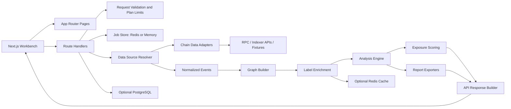

# Wallet Map 架构图

English version: [architecture-map.en.md](architecture-map.en.md)

## 1. 项目定位

Wallet Map 是一个本地优先的钱包关系分析工作台，用于帮助个人、研究者和小团队审计一组地址之间的公开链上关系信号。项目关注证据整理、图谱展示和人工复核优先级，不处理私钥、助记词、签名、托管资产或自动化钱包操作。

核心目标：

- 将多链交易、转账、合约交互和标签数据归一为可解释的关系图。
- 输出直接转账、共享资金来源、共享去向、同合约交互、时间相近行为和多跳路径等证据。
- 以评分和证据明细辅助人工复核，而不是声明地址归属或身份结论。
- 保持可开源、可插拔、可在无托管数据库的本地环境运行。

## 2. 运行边界

项目当前覆盖：

- Next.js Web 工作台。
- EVM 地址分析，优先支持 Ethereum、Arbitrum、Base、BSC 等链。
- fixture 数据集，用于无密钥演示、测试和贡献者快速验证。
- Etherscan-like、NodeReal、Solscan 等数据源适配点。
- 图谱构建、默认分析器、关系评分、证据表和报告导出。
- 可选 PostgreSQL 持久化、Redis job 状态和标签缓存。

项目不覆盖：

- 钱包签名、交易发送、私钥或助记词处理。
- 大规模地址爬虫或批量监控系统。
- 绕过平台规则、规避风控或自动化滥用建议。
- 将弱链上信号解释为身份确认。

## 3. 总体架构

## 4. 应用入口

Web 应用位于 `apps/web`，使用 Next.js App Router。

主要页面：

- `/`：分析工作台，输入地址、选择链和数据源，展示进度、图谱、证据、评分和导出入口。
- `/history`：历史分析列表。仅在 PostgreSQL 可用时返回持久化结果。
- `/labels`：维护者使用的标签管理页面，默认不向用户开放，由 `NEXT_PUBLIC_LABEL_MANAGER_ENABLED` 控制。

主要 API：

- `POST /api/analyze`：创建分析任务，校验输入、创建 job、执行分析并返回结果。
- `GET /api/analyze/jobs/:id`：读取分析 job 状态、进度和完成结果。
- `GET /api/analyze/jobs`：读取历史任务列表，需要 PostgreSQL。
- `GET /api/labels`、`POST /api/labels`：读取和维护本地标签，需要标签管理开关和数据库。
- 钱包登录、ENS、会话相关 API 用于产品边界和历史归属，不参与链上关系推断。

## 5. 数据流

一次分析请求的主流程：

1. 用户在工作台提交地址、链、时间范围和数据源配置。
2. `POST /api/analyze` 进行地址校验、请求大小限制和匿名/登录计划限制。
3. API 创建 job。Redis 可用时保存到 Redis；否则保存到内存 job store。
4. 数据源解析器选择 fixture、Etherscan-like、NodeReal、Solscan 或后续适配器。
5. 适配器拉取或读取原始事件，并转换为统一的 normalized events。
6. Graph Builder 将事件转换为节点、边和证据引用。
7. Label Enrichment 合并内置标签、可选 Chainbase/Etherscan 标签、PostgreSQL 标签和 Redis 缓存。
8. Analysis Engine 运行默认分析器，生成 findings。
9. Scoring 模块生成可解释评分和 confidence。
10. Response Builder 组装图谱、证据、评分、导出数据和 job 状态。
11. PostgreSQL 开启时保存完成快照，便于历史回放。

## 6. 模块边界

### `apps/web`

承载产品界面、路由、API 编排、会话和部署时配置。页面组件不应直接实现数据源、标签源、存储或复杂图谱算法。

### `packages/core`

定义共享领域模型、normalized events、图结构、分析上下文和评分基础类型。这里是跨应用和跨适配器的稳定契约层。

### `packages/adapters`

封装链上数据源。适配器负责获取和标准化数据，不负责关系判断。

### `packages/analyzers`

实现关系分析规则，例如直接转账、多跳路径、共享资金来源、共享去向、同合约交互、时间相近行为和桥接关联。

### `packages/labels`

提供内置实体标签和外部标签源整合。标签是数据增强，不应散落在页面组件或 API 条件判断中。

### `packages/storage`

维护 PostgreSQL schema、repository 接口和持久化实现。Web 应用通过配置开关决定是否启用。

### `packages/exporters`

生成 Markdown、JSON、CSV、PDF 等报告输出。导出逻辑应保留证据引用，并支持后续脱敏能力。

## 7. 存储和缓存

Wallet Map 可以在无 PostgreSQL、无 Redis 的本地 fixture 模式运行。部署到 Vercel 等 serverless 平台时，建议至少配置 Redis，用于跨函数实例保存 job 状态和进度。

### Redis

Redis 用于：

- 分析 job 状态和进度。
- 运行中的分析结果缓存。
- 标签列表和标签查询热缓存。

当前实现读取 `STORAGE_REDIS_ENABLED=true` 和 `REDIS_URL`。未配置时自动退回内存 job store。内存模式适合本地单进程演示，不适合作为 Vercel 正式部署的 job 状态存储。

### PostgreSQL

PostgreSQL 用于：

- 完成的分析 job 快照。
- normalized events、graph nodes、graph edges 和 findings。
- `known_labels` 标签数据。
- 历史列表和历史回放。

当前实现读取 `STORAGE_POSTGRES_ENABLED=true` 和 `DATABASE_URL`。未配置时，历史和标签管理能力会返回 storage-disabled 状态。

## 8. 可插拔扩展

项目预留四类扩展点：

- Chain Adapter：新增链或数据提供商。
- Analyzer：新增关系分析规则。
- Label Provider：新增实体标签来源。
- Exporter：新增报告格式。

扩展模块应遵循现有 package 边界，并保留输入、输出和错误状态的类型契约。

## 9. 隐私和安全原则

- 默认支持本地运行和 fixture 演示。
- 不提交真实 API key、bearer token、JWT、真实钱包地址或用户私有数据。
- 公开示例使用合成地址，例如 `0xaaaaaaaaaaaaaaaaaaaaaaaaaaaaaaaaaaaaaaaa`。
- 报告和 UI 文案描述“关系信号”和“复核优先级”，不描述为身份证明。
- 标签管理页面默认关闭，公开部署仅在维护者明确需要时开启。
