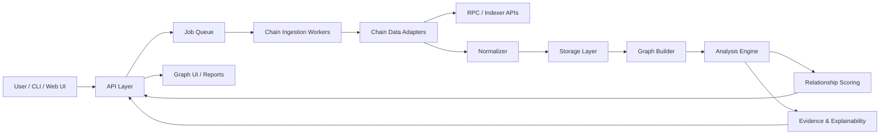

# 钱包关联分析工具架构 MAP

## 1. 项目定位

这是一个面向个人和团队的链上钱包关系审计工具，用来回答：

- 几个钱包之间是否有直接或间接资金往来。
- 它们是否和同一批合约、CEX 充值地址、桥、跨链路由、NFT/Token 合约发生过交互。
- 某些链上行为是否形成了可视化的关联路径。
- 给定一组钱包，哪些关联最强、最值得人工复核。

项目应保持“本地优先、可开源、可插拔、多链扩展”的方向。工具可以帮助用户理解链上可见关联和隐私暴露，但不应内置规避平台风控、批量绕过规则或自动化滥用流程。

## 2. MVP 范围

第一版先做小而清晰：

- 输入 2 到 N 个钱包地址。
- 支持 EVM 链，优先 Ethereum、Arbitrum、Optimism、Base、Polygon、BSC。
- 拉取普通交易、内部交易、ERC20 转账、ERC721/1155 转账、常见跨链桥交互。
- 构建地址关系图。
- 识别直接转账、共同资金来源、共同去向、同合约交互、时间接近的相似操作。
- 输出图谱、路径列表、关联评分和证据明细。

暂不做：

- 自动化钱包操作。
- 规避检测建议。
- 私钥、助记词、签名能力。
- 大规模地址爬虫。

## 3. 总体架构



## 4. 核心模块

### 4.1 Address Set

管理一次分析任务的地址集合。

- 地址标准化：checksum、链 ID、标签。
- 地址分组：用户输入组、观察到的关联地址、系统识别实体。
- 本地备注：例如“主钱包”“测试钱包”“交易所充值”。

### 4.2 Data Adapters

每条链或数据源一个适配器，统一输出标准事件。

适配器接口建议：

```ts
interface ChainAdapter {
  chainId: number;
  getNativeTransactions(address: Address, range?: BlockRange): Promise<RawTx[]>;
  getTokenTransfers(address: Address, range?: BlockRange): Promise<RawTransfer[]>;
  getInternalTransactions?(address: Address, range?: BlockRange): Promise<RawInternalTx[]>;
  getContractMetadata?(address: Address): Promise<ContractMetadata | null>;
}
```

首批数据源可以支持：

- RPC provider：基础交易和日志。
- Etherscan-like API：快速拿交易、内部交易、Token 转账。
- Covalent / Moralis / Alchemy / QuickNode Streams：后续作为可选插件。
- 本地 CSV 导入：便于用户从现有网站导出后分析。

### 4.3 Normalized Event Model

所有链上数据归一成少数几类事件：

```ts
type NormalizedEvent =
  | NativeTransferEvent
  | TokenTransferEvent
  | ContractCallEvent
  | BridgeEvent
  | DexSwapEvent
  | NftTransferEvent;
```

每个事件至少包含：

- `chainId`
- `txHash`
- `blockNumber`
- `timestamp`
- `from`
- `to`
- `asset`
- `amount`
- `contract`
- `methodId`
- `eventType`
- `rawRef`

### 4.4 Storage Layer

推荐先用 PostgreSQL，后续视需求增加图数据库。

MVP：

- PostgreSQL + Prisma/Drizzle。
- 关键表：addresses、analysis_jobs、transactions、transfers、contract_calls、edges、findings、labels。
- 图计算先在应用层完成，避免一开始引入过多基础设施。

后续增强：

- Neo4j：更复杂路径查询。
- DuckDB：本地分析、离线 CSV。
- ClickHouse：大规模历史数据。

### 4.5 Graph Builder

把事件转换成图。

节点：

- Wallet
- Contract
- CEX / Bridge / DEX / Known Entity
- Token / NFT Collection

边：

- Native Transfer
- Token Transfer
- NFT Transfer
- Contract Interaction
- Shared Counterparty
- Temporal Similarity
- Bridge Route

边需要保存证据，不只保存结论：

- 交易哈希列表。
- 时间窗口。
- 金额。
- 链。
- 来源事件。

### 4.6 Analysis Engine

第一批分析器用插件式设计：

```ts
interface Analyzer {
  id: string;
  name: string;
  run(context: AnalysisContext): Promise<Finding[]>;
}
```

建议内置分析器：

- Direct Transfer Analyzer：A 和 B 是否直接转账。
- Multi-hop Path Analyzer：A 到 B 是否存在 2 到 4 跳路径。
- Shared Funding Source Analyzer：是否来自同一上游地址。
- Shared Withdrawal / Deposit Analyzer：是否流向同一 CEX、桥或聚合器。
- Same Contract Interaction Analyzer：是否交互过同一合约。
- Temporal Pattern Analyzer：是否在相近时间执行相似操作。
- Bridge Correlation Analyzer：跨链桥入桥和出桥路径是否可疑地接近。
- NFT / POAP / SBT Overlap Analyzer：是否持有或转移过相同 NFT 类资产。

### 4.7 Scoring

关联评分应可解释，不做黑盒结论。

建议输出：

- `score`: 0 到 100。
- `confidence`: low / medium / high。
- `reasons`: 证据列表。
- `counterEvidence`: 降低可信度的因素。

评分示例：

- 直接转账：强关联。
- 同一资金来源：中到强关联，取决于来源是否是 CEX/公共合约。
- 同合约交互：弱到中关联。
- 时间接近且操作相似：弱到中关联。
- 多个弱信号重叠：可提升关联等级。

### 4.8 UI

第一版 UI 应直接服务分析，不做营销页。

关键页面：

- Address Input：输入钱包、选择链、时间范围、API key。
- Analysis Overview：总评分、关键发现、风险矩阵。
- Graph Explorer：节点图、边类型过滤、路径高亮。
- Evidence Table：交易哈希、时间、链、金额、事件类型。
- Report Export：Markdown / JSON / CSV。

图谱库候选：

- React Flow：实现快，适合交互式图谱。
- Cytoscape.js：图分析能力更强。
- Sigma.js：大图渲染更强。

## 5. 推荐技术栈

### 方案 A：开源友好的一体化 TypeScript

- Frontend：Next.js + React + Tailwind CSS
- API：Next.js Route Handlers 或 Hono
- Worker：BullMQ + Redis
- DB：PostgreSQL + Drizzle ORM
- Graph UI：React Flow 或 Cytoscape.js
- Package Manager：pnpm

优点：前后端统一语言，开源贡献门槛低。

### 方案 B：分析能力更强的 Python 后端

- Frontend：Next.js
- API：FastAPI
- Worker：Celery / Dramatiq
- DB：PostgreSQL
- Analysis：networkx / pandas / duckdb
- Graph UI：Cytoscape.js

优点：链上数据分析和图算法更舒服。

建议从方案 A 开始；如果后续复杂图算法变多，再把 Analysis Engine 拆成 Python 服务。

## 6. 插件扩展设计

需要预留四类插件：

- Chain Adapter：新增链或数据源。
- Analyzer：新增关联分析规则。
- Label Provider：实体标签库，例如 CEX、桥、DEX、项目方合约。
- Exporter：导出 JSON、CSV、Markdown、HTML 报告。

目录结构建议：

```text
apps/
  web/
packages/
  core/
    models/
    graph/
    scoring/
  adapters/
    evm-etherscan/
    evm-rpc/
    csv-import/
  analyzers/
    direct-transfer/
    multi-hop-path/
    shared-counterparty/
    temporal-pattern/
  labels/
    static-registry/
  exporters/
    markdown/
    json/
docs/
```

## 7. 数据隐私原则

- 默认本地运行。
- 不上传用户地址集合，除非用户明确配置远程服务。
- API key 放在本地 `.env`。
- 报告默认脱敏选项：隐藏部分地址、金额区间化。
- 不保存私钥，不请求签名。
- 开源 README 中明确项目边界：用于个人链上足迹审计、研究和合规分析。

## 8. 任务清单

### 产品与边界

- [ ] 确认 MVP 支持哪些链。
- [ ] 确认第一版只做本地分析还是支持部署版。
- [ ] 定义项目使用边界和开源免责声明。
- [ ] 定义报告里“关联”“风险”“证据”的措辞。

### 数据层

- [ ] 设计标准事件模型。
- [ ] 设计 PostgreSQL schema。
- [ ] 实现 EVM 地址校验和 checksum。
- [ ] 实现 Etherscan-like adapter。
- [ ] 实现 RPC log adapter。
- [ ] 支持 CSV 导入。

### 分析层

- [ ] 实现 Direct Transfer Analyzer。
- [ ] 实现 Multi-hop Path Analyzer。
- [ ] 实现 Shared Counterparty Analyzer。
- [ ] 实现 Same Contract Interaction Analyzer。
- [ ] 实现 Temporal Pattern Analyzer。
- [ ] 实现评分器和解释器。
- [ ] 为每个 finding 保存证据交易。

### UI 层

- [ ] 地址输入页。
- [ ] 分析任务状态页。
- [ ] 总览页。
- [ ] 图谱浏览器。
- [ ] 证据表格。
- [ ] 报告导出。

### 工程化

- [ ] 初始化 monorepo。
- [ ] 配置 lint、format、typecheck。
- [ ] 配置测试框架。
- [ ] 增加 fixture 数据。
- [ ] 写贡献指南。
- [ ] 写 README 和 Roadmap。

### 可并行推进

- [ ] A 线：产品边界、README、术语定义。
- [ ] B 线：数据模型、数据库 schema、adapter 接口。
- [ ] C 线：分析器接口、评分模型、fixture 测试。
- [ ] D 线：UI 原型、图谱交互、报告布局。
- [ ] E 线：开源工程化、CI、贡献指南。

## 9. 第一阶段交付物

第一阶段完成后应该有：

- 可输入多个钱包地址。
- 可选择 EVM 链和时间范围。
- 可拉取并缓存交易数据。
- 可输出地址关系图。
- 可列出直接交易、多跳路径、共同交互对象。
- 可导出 Markdown/JSON 报告。
- 有一组公开 fixture 测试数据，方便开源贡献者验证。

